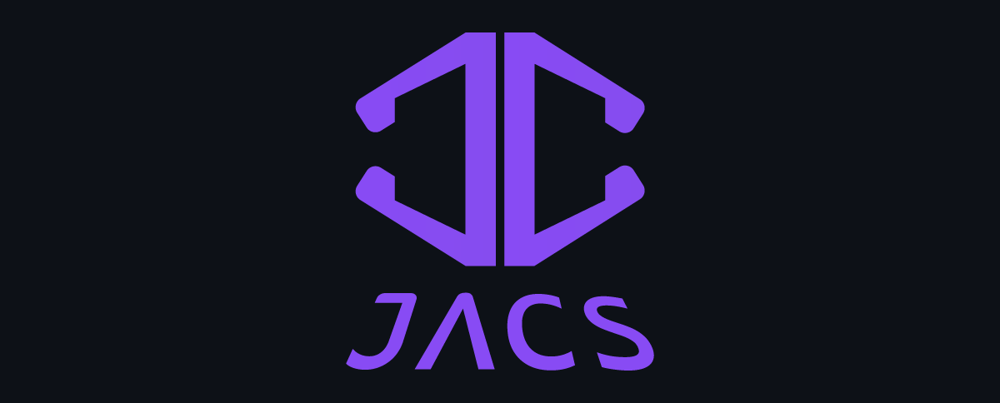

  
    
  
<b>Engineering scalable B2B and SaaS platforms with a focus on cloud-native infrastructure, secure production-grade architectures, and AI-driven solutions.</b>

 

  <h2>🛠️ Core Tech Stack</h2>
   
  
  
<b>Frontend</b>

  
  
  
  
  
  

    
  
<b>Backend</b>

  
  
  
  
  
  

    
  
<b>Infrastructure & Database</b>

  
  
  
  
  
  

    
  
<b>AI Integration</b>

  
  

 

## 🏢 Production-Grade B2B Projects

### ⚡ [Boman Electric del Ecuador](https://bomanelectric.com)
**Full-Stack Engineer** | *B2B Digital Platform & CMS*
* **Tech Stack:** Next.js 16, TypeScript, NestJS, PostgreSQL, Cloudinary, Railway, Cloudflare.
* **Architecture:** Architected a production-grade B2B digital platform with a custom CMS, leveraging Next.js Server Components and NestJS REST APIs.
* **Performance:** Engineered a hybrid rendering strategy (SSG+ISR+On-Demand Revalidation), achieving SEO-optimized content delivery and ~90% backend load reduction.
* **Security & Infrastructure:** Implemented secure authentication using HttpOnly JWT cookies and CSRF protection, and deployed a cloud-native infrastructure.

 

### ⚙️ [Cenespe Industrias](https://cenespeindustrias.com)
**Full-Stack Engineer** | *B2B E-commerce Ecosystem*
* **Tech Stack:** Node.js, Express, MongoDB, Pug (SSR), Bootstrap 5, JWT, PayPhone API, Railway.
* **Architecture:** Architected and deployed a B2B e-commerce ecosystem leveraging Node.js and Pug (SSR) to digitize a multi-category catalog.
* **API & Integration:** Engineered high-performance RESTful APIs using MongoDB aggregations, and integrated the PayPhone API for automated payment processing.
* **Security & DevOps:** Hardened platform security by implementing brute-force protection and rate limiting, while managing a CI/CD pipeline for zero-downtime production.

 

  <h2>📫 Get in Touch</h2>
  

    🌐 <a href="https://jacs.dev">Portfolio (jacs.dev)</a> &nbsp; | &nbsp;
    ✉️ <a href="mailto:contact@jacs.dev">contact@jacs.dev</a> &nbsp; | &nbsp;
    💼 <a href="https://linkedin.com/in/joel-cuascota">LinkedIn</a>
